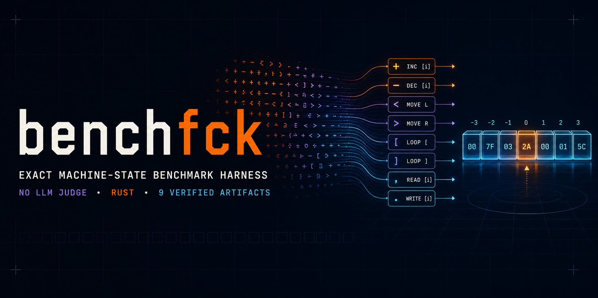
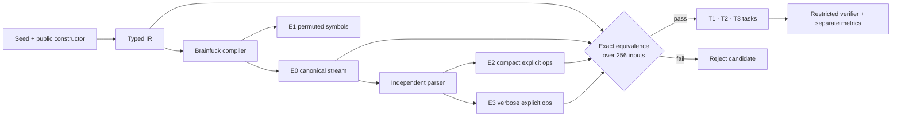
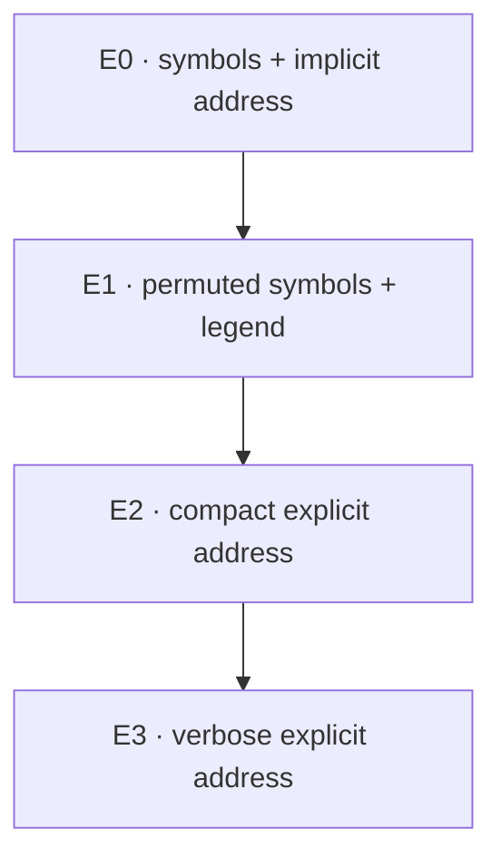
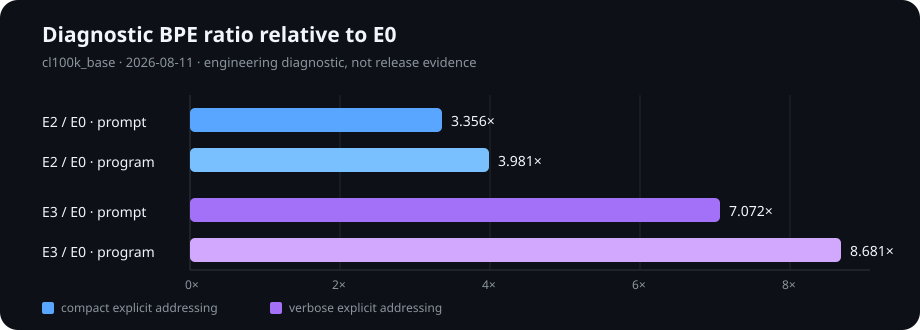

# benchfck

[](https://github.com/muend/benchfck)
[](VALIDITY.md)
[](VALIDITY.md)
[](evidence/README.md)
[](https://github.com/muend/benchfck/actions/workflows/ci.yml)
[](https://github.com/muend/benchfck/actions/workflows/codeql.yml)
[](LICENSE)
[](Cargo.toml)

## What this is

`benchfck` is a Brainfuck-based generator and exact Rust harness for producing,
validating, and scoring machine-state tasks over controlled instruction encodings. It
generates programs and program–input items rather than shipping a fixed dataset. Program
execution, cross-encoding equivalence, answer verification, and metric production are
deterministic; no learned judge is used.

> [!IMPORTANT]
> **v0.4.0-alpha engineering candidate. No model results have been produced. No
> leaderboard exists. The official v0.4 evidence scope is arity 1; release gates in
> [`VALIDITY.md`](VALIDITY.md) beyond the completed Phase 2 population package remain unmet.**

## Project progress

```mermaid
flowchart LR
    P0["Phase 0<br/>repository + evidence infrastructure<br/>complete"] --> P1["Phase 1<br/>measurement instruments<br/>complete"]
    P1 --> P2["Phase 2<br/>arity-1 release evidence<br/>complete"]
    P2 --> PE["Private scoring population<br/>offline validated<br/>epoch planned"]
    PE --> P3["Phase 3<br/>preregistration frozen<br/>model pilot not run"]
    P3 --> P4["Phase 4<br/>statistical analysis"]
    P4 --> P5["Phase 5<br/>release + independent reproduction"]
    classDef complete fill:#173a32,stroke:#55d6a0,color:#f4f1ea;
    classDef staged fill:#3b2f12,stroke:#f2c14e,color:#fff7dc;
    classDef pending fill:#172033,stroke:#64748b,color:#cbd5e1;
    class P0,P1,P2 complete;
    class PE staged;
    class P3,P4,P5 pending;
```



The deterministic arity-1 population package is complete and manifested. The
[`model-pilot preregistration`](evidence/preregistration.md) is now frozen before any
provider response: three model families, an H1-only confirmatory plan, a 2,160-call pilot,
and a $40 pilot ceiling are fixed. A separate private arity-1 population has passed the
offline gate suite and is bound by the content-free
[`v0.4-private-001` planned epoch record](epochs/v0.4-private-001.json); the epoch is not
active and no private source or answer key is published. No model API call has occurred or
is authorized by publication alone. Before the pilot, the provider runner, offline
controls, paid access, epoch activation, and an explicit start authorization must all pass.
The provisional $700 full-run ceiling requires a separate post-pilot go/no-go. The
offline/paid boundary is documented in
[`docs/EVALUATION-RUNBOOK.md`](docs/EVALUATION-RUNBOOK.md).



## Pinned execution semantics

This block is included verbatim in every emitted task prompt and enforced by the
executors:

```text
cell = 8-bit unsigned, wraps at 255→0 and 0→255
tape = 30,000 cells, pointer starts at 0, moving left of 0 is a hard error
`,` on exhausted input sets the cell to 0
step cap = 8,000,000; exceeding it classifies the run as `NON_TERMINATING`
```

## Encoding ladder

Each rung preserves execution semantics while changing how operands and operations are
written. The snippets below are illustrative syntax, not a benchmark item or answer key.

| Rung | Representation | Illustrative line | Isolated intervention |
|---|---|---|---|
| **E0** | Canonical Brainfuck | `>>>>+[-<+>]` | Implicit pointer-relative addressing |
| **E1** | Per-item symbol permutation plus operational legend | `+[[.<,]` | Surface-symbol identity |
| **E2** | Compact explicit operations, RLE carrier | `M23*18` | Explicit cell addressing |
| **E3** | Verbose explicit operations, RLE carrier | `MOVE cell 23 count 18` | Lexeme length and descriptiveness |





The chart reports one engineering diagnostic measured on **2026-08-11** with
`cl100k_base`; it is not release evidence and contains no task score. Ratios are relative
to E0. Total-prompt ratios are used for matching because the entire prompt is consumed;
program-only ratios describe intervention strength.

| Contrast | Prompt BPE ratio | Program BPE ratio | Analysis rule |
|---|---:|---:|---|
| E2 / E0 | 3.356× | 3.981× | No ratio ceiling; only preregistered token-matched pairs |
| E3 / E0 | 7.072× | 8.681× | No ratio ceiling; only preregistered token-matched pairs |

## Task families

**T1 — State tracking.** Given an encoding, input, and an interior execution step, return
the requested machine-state fields. Three seed-rotated probes are emitted per encoding;
first divergence and error criticality remain separate diagnostics.

**T2 — Computation compression.** Return a restricted arithmetic expression that matches
the program over the complete input domain. Responses are parsed into a safe AST, constant
folded, and exhaustively checked; arbitrary submitted code is never executed. The hybrid
nontriviality certificate is exact only through its measured enumeration depth and then
adds named, witness-producing analytical exclusions.

**T3 — Causal mutation.** Predict the output after a specified program mutation. Mutation
position is recorded as an early/middle/late covariate, and each item has one response cap
shared across E0–E3.

**T4–T6 are reserved.** Their schema identifiers exist, but no official task, score, or
claim is attached to them in this alpha.

## Acceptance gates

Configured values come from [`config/defaults.toml`](config/defaults.toml); the full
validity contract is [`VALIDITY.md`](VALIDITY.md).

| Gate | Current value | Scope |
|---|---:|---|
| Cell model | unsigned 8-bit, wrapping | all executions |
| Tape / left boundary | 30,000 cells / hard error | all executions |
| Step cap | 8,000,000 | all executions; measured tier-9 max 5,678,676 + 40.9% margin |
| Official v0.4 input arity | 1 | release generation and complete-domain evidence (256 bindings) |
| Diagnostic/library arity ceiling | 2 | deferred v0.5 research path; requires a separate configuration and bivariate certificate |
| Layout disciplines | 4 | three generation layouts + explicit held-out layout |
| Statement templates target | 3 | compiler diversity |
| Per-argument sensitivity | required | candidate acceptance |
| IR ≡ E0 ≡ E2 ≡ E3 | full input domain | candidate acceptance |
| Trace semantic density | ≥ 0.30 | candidate acceptance |
| Source-text semantic density | no floor | recorded covariate; see the gate ledger in `VALIDITY.md` |
| Avalanche score | ≥ 0.60 | candidate acceptance |
| Avalanche sampled positions | ≥ 64 | candidate acceptance |
| Canonical-idiom rate | < 0.08 | candidate acceptance |
| E2/E0 prompt BPE ratio | exempt (`cl100k_base`) | recorded covariate; token-matched analysis only |
| E3/E0 prompt BPE ratio | exempt (`cl100k_base`) | recorded covariate; token-matched analysis only |
| T1 probes | 3 per encoding | public task export |
| T2 folded expression threshold | 25 restricted-grammar tokens | hybrid nontriviality gate |
| T2 exact enumerator | target AST depth 7; proven minimum 3 | measured, never reported as depth 24 |
| T2 response safety cap | 384 tokens | one item-level cap across E0–E3 |
| T3 response safety cap | 96 tokens | one item-level cap across E0–E3 |
| Size ladder | 10 labelled tiers | function-preserving reversible work |
| Matched-pair batch gate | ≥30 disjoint pairs per E0↔E2 and E0↔E3 | 100-item batch, ≤10% BPE gap |

## Quick start

The complete local smoke path needs Rust only—no API key or external model service.

```powershell
cargo build --release

cargo run --release -- generate `
  --seed 42 --count 1 --difficulty hard --arity 1 `
  --output target/benchfck-public.jsonl

cargo run --release -- validate `
  --input target/benchfck-public.jsonl

cargo run --release -- generate `
  --seed 42 --count 1 --difficulty hard --arity 1 --with-answers `
  --output target/benchfck-private.jsonl

cargo run --release -- mock-run `
  --input target/benchfck-private.jsonl `
  --output target/benchfck-metrics.jsonl --solver perfect
```

Generated files are diagnostics by default and cannot enter `evidence/`. A future release
evidence run must explicitly pass `--artifact-class evidence`, write below `evidence/`, and
update the SHA-256 manifest.

Verification commands:

```powershell
./scripts/verify-evidence.ps1
./scripts/verify-local-controls.ps1
cargo fmt -- --check
cargo clippy --all-targets -- -D warnings
cargo test
cargo test --release --test property_10k five_hundred_program_fast_property_shard -- --exact
cargo test --release --test property_10k -- --ignored
```

The scheduled/manual GitHub workflow partitions the same deterministic 10,000-program
population into four balanced, non-overlapping CI jobs. The release-evidence command still
runs the complete population in one process, so sharding cannot change the published
protocol or artifact.

The local-control script requires the ignored private Phase 2 batch and writes only
diagnostics below `target/`; it does not contact a provider or create model evidence.
The [`offline model-runner boundary`](docs/MODEL-RUNNER.md) likewise turns an
answer-stripped packet into deterministic, hashed request cells and validates immutable
retry/resume logs without credentials, network access, or provider cost.

Release-readiness protocols:

- [`docs/REPRODUCIBILITY.md`](docs/REPRODUCIBILITY.md) separates manifest integrity,
  clean-checkout regeneration, and the still-missing independent reproduction gate.
- [`docs/HUMAN-REVIEW-PROTOCOL.md`](docs/HUMAN-REVIEW-PROTOCOL.md) fixes the review
  boundary without pretending that model responses already exist.
- [`docs/SCORING-EPOCHS.md`](docs/SCORING-EPOCHS.md) defines private-constructor
  commitments, fail-closed lifecycle validation, and one-way rotation; no private scoring
  epoch exists yet.
- [`docs/PRIVATE-CONSTRUCTOR-INTEGRATION.md`](docs/PRIVATE-CONSTRUCTOR-INTEGRATION.md)
  defines the injectable typed-IR provider boundary; no private provider or population is
  included in this repository.
- [`docs/MODEL-RUNNER.md`](docs/MODEL-RUNNER.md) defines answer-stripped request planning,
  frozen system identity, immutable attempt records, and fail-closed resume behavior; it
  contains no network client.
- [`docs/TECHNICAL-REPORT.md`](docs/TECHNICAL-REPORT.md) freezes the report structure and
  release-gate matrix while keeping every unrun result visibly marked.

## Evidence status

| Evidence class | Published count | Meaning |
|---|---:|---|
| Model runs | **0** | No external evaluation has been run |
| Release evidence artifacts | **10** | Nine Phase 2 population artifacts plus the frozen, pre-response model-pilot preregistration |
| Planned scoring epochs | **1** | Content-free private-set commitments exist; activation and model scoring remain blocked |
| Leaderboards | **0** | No ranking or aggregate benchmark score exists |
| Engineering diagnostics | local only | Used to test instrumentation; not benchmark evidence |

## What is deliberately absent

- No external model adapter is wired into the repository.
- No answer-bearing item, private constructor, or oracle artifact is published.
- No completed model-evaluation, human-review, or clean-reproduction package is present.
- No benchmark score, model comparison, leaderboard, or validity claim is reported.
- E4 natural-language rendering exists only as residual-risk diagnostic code and is not an
  official evaluation rung.

## Known limitations

1. **Open-generator hypothesis space.** Publishing a constructor family reveals that
   family to anyone inspecting the source. The public mechanism and a public constructor
   subset support development; official scoring requires a separate, unpublished
   constructor set and a documented one-way rotation policy. The first private set now has
   a `planned` commitment record, but it is not an active scoring epoch and remains
   ineligible for model calls until custodian activation and the remaining frozen-plan
   execution gates pass.
2. **Arity-1 release scope.** v0.4 deliberately admits only arity-1 evidence. Arity-2
   remains a v0.5 research target because its 65,536-point domain needs a memory-safe
   exact enumerator and a genuinely bivariate analytical certificate; removing the
   current guard would not constitute valid evidence.
3. **E3 length control.** E3 intentionally has no 3.5× ratio gate. Any E3 analysis must use
   preregistered token-matched pairs; an unmatched raw contrast is not admissible evidence.
4. **Constructor breadth.** The bias-invariant v4 design search produced 1,730 unique
   semantic functions in 51 coarse profile buckets, correcting a 108-record overcount
   caused by adjacent-only deduplication.
   The largest bucket contains 250 functions, so profile count is not a count of independent
   semantic classes. Eight public constructors across four structural families pass the
   full-domain, hybrid-gate, reference, step-cap, accepted-population, and duplicate-audit
   checks. Four families remain a narrow public development subset and do not substitute
   for an unpublished official-scoring constructor population.
5. **Unmet release work.** Private-epoch activation, provider-runner controls, external
   model runs, human review, statistical analysis, and independent clean-room reproduction
   are outstanding. The completed public and private offline populations and frozen
   preregistration are engineering evidence, not model-validity claims.

## Citation and license

Citation metadata is available in [`CITATION.cff`](CITATION.cff). Software, schemas,
documentation, and the published constructor mechanism are copyright © 2026 Muhammed
Enes Duran and licensed under [Apache-2.0](LICENSE). Public generated datasets, if and
when released, will carry a separate [CC BY 4.0](https://creativecommons.org/licenses/by/4.0/)
notice. Private constructors and answer keys are not distributed.

See [`docs/GLOSSARY.md`](docs/GLOSSARY.md) for terminology and
[`SECURITY.md`](SECURITY.md) for the execution boundary.
